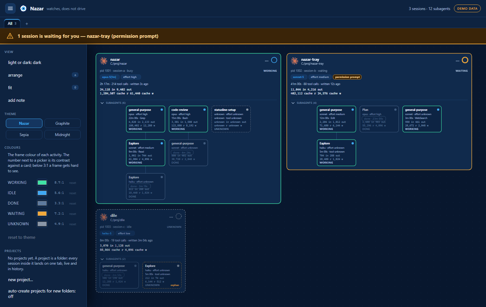
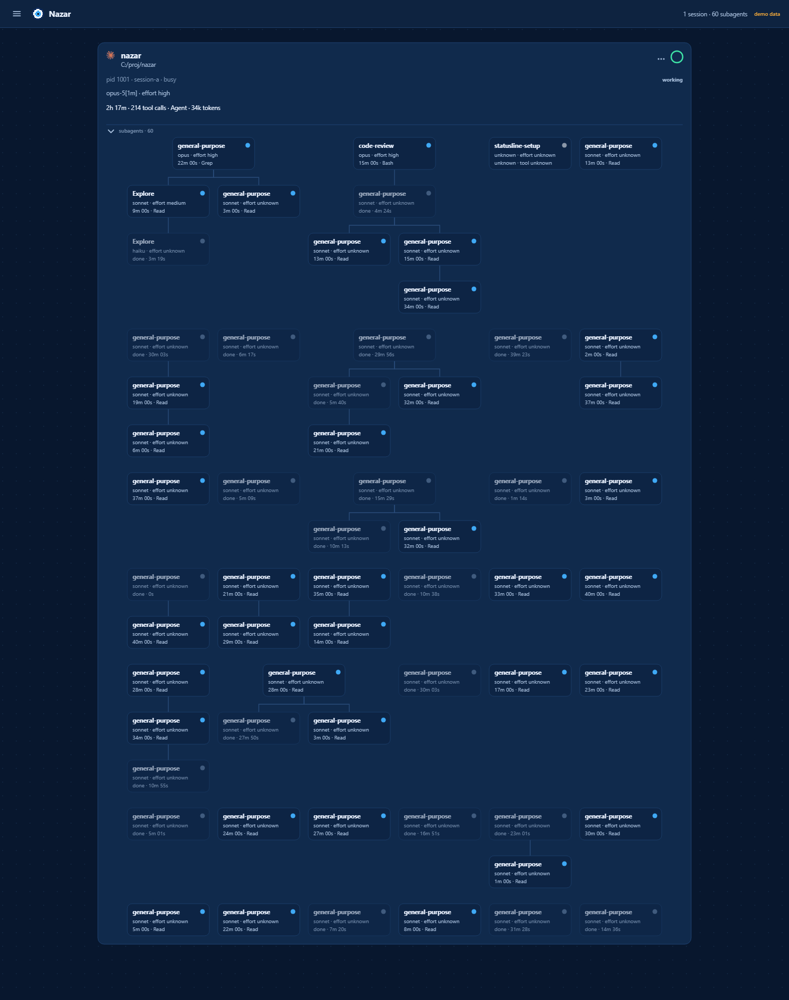
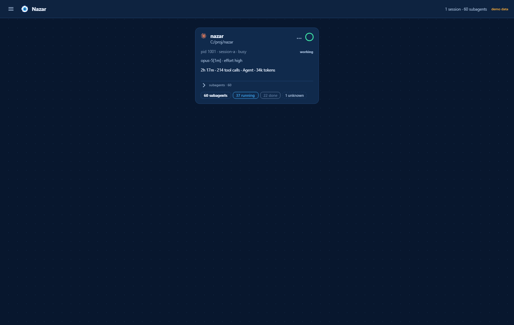
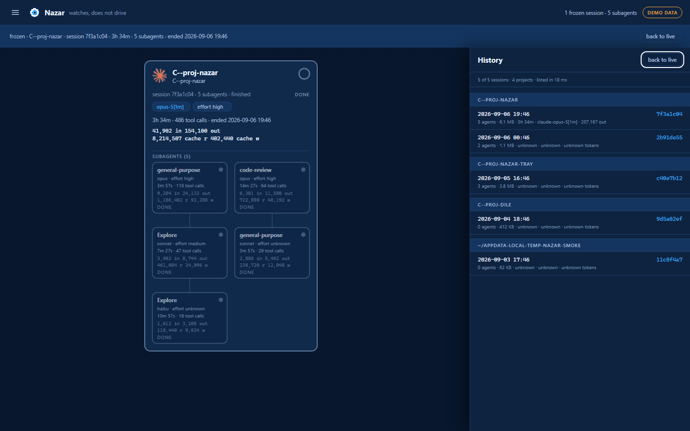
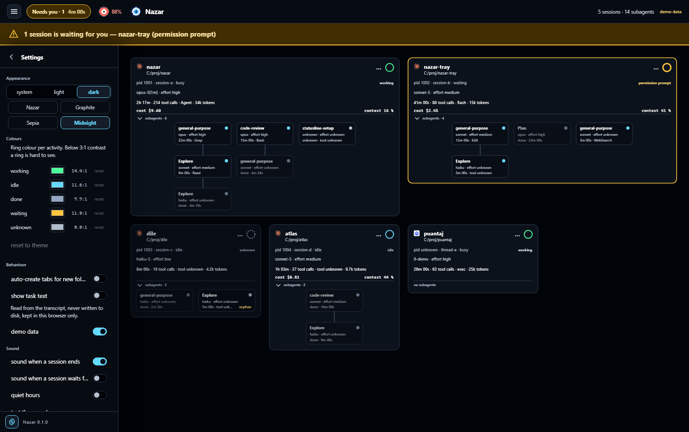
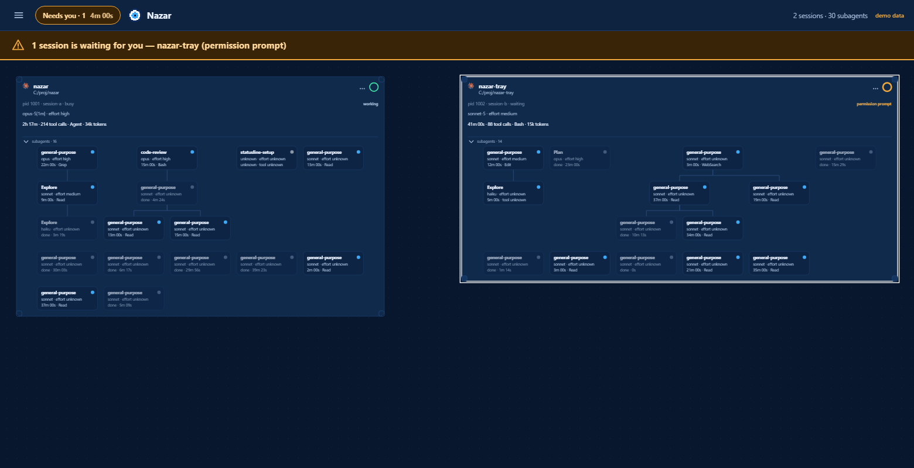
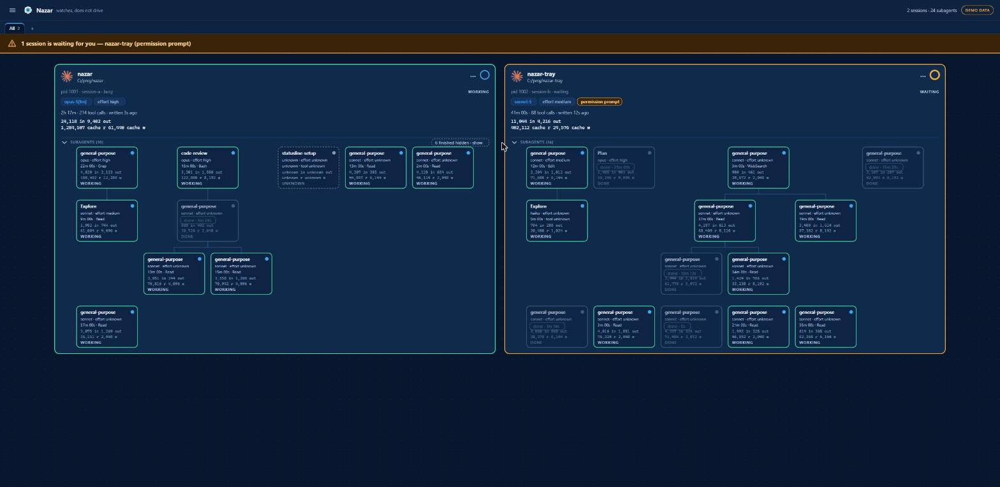

# 🧿 Nazar

**Keep a nazar on your agents.**

Nazar is a local, open-source monitor for AI coding agents. Every running Claude Code session shows up as a node on one live canvas, with its subagents drawn as a tree underneath. Hover a node to see the model, effort level, elapsed time, current tool and exact token usage. A session waiting for your permission is impossible to miss. Finished subagents stay on the canvas, faded, with how long they ran — and **the History panel opens any past session as a frozen tree**, so you can answer "how many tokens did that run take, and how long did it last" after the fact.

It watches. It does not launch, control, or answer permission prompts. **It installs no hooks and writes nothing into your Claude Code settings**: everything it shows is read from files Claude Code already writes, from `claude agents --json`, and — where a second program has left them — from `~/.nazar/limits.json`, `~/.nazar/statusline/<session>.json` and a project's own `.claude/settings.json` and `.claude/settings.local.json`.

> Status: **0.1.0, feature-complete and not yet published.** Everything below is built and smoke-tested on Windows, macOS and Linux: the free canvas with tabs, the activity frames, the Windows desktop shell and its jump to terminal, usage limits, cost and context window, four themes, your own frame colours, sticky notes, card resize, clear-finished, card names and projects. What is missing is the release itself — it is not on npm yet, so `npx @xfurqan0/nazar` will not resolve until the first one. Until then, clone it and run from source (see [Development](#development)). [docs/PROJECT.md](docs/PROJECT.md) holds the v1 plan; [CHANGELOG.md](CHANGELOG.md) holds what 0.1.0 contains.










## Install

Node 22 or newer, and nothing else. There is no build step, no config file and no account.

```
npx @xfurqan0/nazar
```

That starts a small server on `http://127.0.0.1:4676` and opens it in your browser. `--port <n>` moves it, `--no-open` skips the browser, `--version` (`-V`) prints the version, `--help` (`-h`) prints the flags, and `Ctrl+C` ends it. `-v` belongs to `doctor`, where it is the short form of `--verbose`; typing it anywhere else is an error naming the flag rather than a version quietly printed instead of the command you asked for. Any flag Nazar does not know stops the command with exit code 2 and one line of usage — a misspelled flag that changes nothing and says nothing is the worst answer available.

**If the browser does not open, paste the URL.** It is printed on its own line before anything is launched, so it is always there to copy. Nazar hands it to the platform's opener — and on Windows to two more after that, because each one fails differently — but nothing on Windows can report whether a browser actually appeared: `start` exits 0 whether or not the shell found a handler. So Nazar prints `if no browser opened, open the URL above` rather than claim a success it cannot verify. `nazar doctor` prints the exact chain it would walk on your machine.

Installing it permanently is optional:

```
npm install -g @xfurqan0/nazar
nazar
```

Uninstalling is `npm uninstall -g @xfurqan0/nazar`, and there is nothing else to remove: Nazar creates no directory, writes no configuration and changes nothing about Claude Code.

If the canvas is empty and you expected sessions, ask it why:

```
nazar doctor
```

`doctor` starts no server. It prints where your Claude Code configuration directory resolved to (`CLAUDE_CONFIG_DIR` included), how many session files and transcripts it can see, whether `claude agents --json` answers and how long it takes, which usage-limits source it found and every window that source reports — or that neither source exists on this machine — which of the formats in [docs/pinned-internal-formats.md](docs/pinned-internal-formats.md) it could validate against your machine, the browser-opener chain it would walk, and — when the canvas would draw nothing — the reason. It also relates the two counts that used to sit in separate sections: every live session that has no status-line capture gets a line naming the likeliest reason — a `statusLine` its project sets for itself, a user-level status line that is not the wrapper, a session that started before the wrapper was installed, or simply a turn that has not happened yet, since Claude Code runs the status line after one. Paths are printed with your home directory collapsed to `~`; `--verbose` (`-v`) prints them in full.

## Desktop app (Windows)

There is a second way to run the same thing: `nazar-desktop_0.1.0_x64-setup.exe`, published beside the npm package on each release. It is a small Tauri window and a tray icon around **exactly the canvas above** — it starts the very package `npx` runs, on a loopback port it picks once and then remembers, and shows it.

**The installer is unsigned.** There is no code-signing certificate behind it, so Windows SmartScreen warns the first time you run it and you have to choose *More info · Run anyway*. That clears itself once the download has built enough reputation, which is a matter of downloads rather than of anything that can be done to the file.

Two reasons it exists, and only the second is a real one:

- The window sits in the tray and survives the close button, so the monitor is there when you want it and out of the way when you do not. Left-click the bead to show it, right-click for **Open · Refresh · Quit**, and turn on *start with Windows* in the sidebar. A second launch focuses the first window instead of starting a second server.
- **Jump to terminal.** Double-click a session card — or press <kbd>Enter</kbd> on it, or use *Jump to terminal*, the first entry in the card's `⋯` menu, which a right-click opens at the pointer — and the terminal running that Claude Code session comes to the front. A browser tab cannot do that, and it is why the desktop app was pulled forward out of v2.

  **It brings the existing window forward; it never opens a new terminal.** The whole feature is a window handle and an accessibility call: find the window that already hosts the session, select its tab, restore it if it was minimised, and ask Windows to put it in the foreground. Nothing starts a process — not `wt.exe`, whose `focus-tab` subcommand would work now that the tab index is known, and not a shell. If a terminal seems to *appear* when you jump, it is a window that was already running and was minimised or behind something else. Two tests hold that line: one reads the jump's own source and fails on any process-creation call, the other takes a process snapshot before and after a real jump and fails if anything terminal-shaped shows up in between.

**Requirements: Node 22 or newer, which you already have.** Nothing is bundled, and that is deliberate rather than lazy: Claude Code is itself a Node program, so any machine with sessions worth watching has a Node runtime on `PATH` already. Bundling one would add tens of megabytes to insure against a case that cannot arise while this application has a purpose. If the assumption is wrong on your machine the window says so, with the download address and whatever `nazar doctor` could still report — it does not sit there empty.

**What jump can and cannot do:**

| | |
|---|---|
| ✅ Raises the **window** hosting the session | eleven hosts, best first: Windows Terminal, conhost, OpenConsole, VS Code, Cursor, mintty (Git Bash), Alacritty, WezTerm, then `powershell`, `pwsh` and `cmd` — the last three ranked last on purpose, because on Windows the console window belongs to `conhost` and not to the shell drawing into it, so a shell that owns one at all is the answer of last resort. Anything else owning a top-level window above the session in the process tree is raised too |
| ✅ Selects the right **tab** — and the right **window** | by matching the tab's title against the session's own. This carries more weight than it sounds like: **every** Windows Terminal window on a machine belongs to one `WindowsTerminal.exe`, so without the title there is nothing to tell four windows apart and the same one comes forward every time |
| ✅ Restores it if it was minimised | and reports what it raised — which tab, how the title was matched, and whether two tabs shared one — so a jump that lands somewhere surprising tells you where *and* why |
| ✅ Finds a session too new to have a title | two fallbacks, in that order. **Exclusion** first: work out which tabs the *other* running sessions are in and take the one left over. Then the **default title**: a session *known* to have no generated title of its own claims a single remaining tab still reading `claude code`, and the jump reports itself as `rung: "b-default"` so a surprising landing says which rung found it |
| ❌ Does **not** open the integrated terminal panel in VS Code or Cursor | the editor window comes forward; which panel it then shows is the editor's business. Their **editor** tabs are never touched: only Windows Terminal is searched for tabs at all. Measured live on 2026-09-08 against a `claude` running in a VS Code integrated terminal: the chain is `claude.exe → powershell.exe → Code.exe → Code.exe`, the editor window came forward from behind another application, and the jump reported `rung: "a"` |
| ❌ Does **not** pick between windows it cannot tell apart | it raises nothing and says how many could have been yours. Two editor windows, or two sessions neither of which has a title yet, are the cases this happens in |
| ❌ macOS and Linux | not yet. The window and the tray are portable; the jump says so rather than doing nothing. |

**If Nazar cannot tell which window is yours it says so rather than guessing.** The tab is found by its title, and the title a terminal is showing is the one Claude Code generated for that conversation. A session it has not titled yet has nothing to match on; a session whose terminal title something else has overwritten has the wrong thing. When that happens Nazar first works out which tabs are already spoken for — every other running session is matched the same way, and a tab one of them is demonstrably in is not yours. The claim is taken **tab by tab and not window by window**, which is the safe half of that choice: a window holding somebody else's matched tab *and* an unclaimed one may still be yours, and striking the whole window would throw that away. If exactly one tab is left over, that one is yours. If none is — every candidate belongs to somebody else — the answer is **nothing**, which is a fact about the machine rather than a failure: this session's terminal is not among these windows. If several are left over, **nothing is raised** either: the hint says how many windows could have been this session and asks you to `/rename` it, which is the one action that fixes it from where you are sitting. Being sent to a stranger's terminal is worse than being told Nazar does not know, because from the outside a lucky guess and a right answer look identical.

**Browser mode is unchanged and stays first-class.** `npx @xfurqan0/nazar` is still the install-free way in, still the one most people will use, and it is the same canvas — one page, one bundle, no desktop-only fork of it. In a browser the jump entry is simply not drawn, and a double-click on a card says where the feature lives instead of failing silently.

Uninstall from Windows *Installed apps*. It leaves `%APPDATA%\nazar\desktop.json` — `schemaVersion`, `autostart` and `port`, plus any key a later build wrote, which is round-tripped rather than dropped, and `$NAZAR_HOME` moves the whole file elsewhere if you set it — and nothing else; turn *start with Windows* off before uninstalling and the startup entry goes too. `port` is the loopback port the canvas is served on, chosen once and then kept: your canvas is stored by the browser per origin and an origin includes the port, so a number that changed every launch was a workspace that emptied every launch. Delete the file and you get a new port and a fresh canvas; nothing else is affected.

## What you see

- **One card per running session**, labelled with the working directory's basename and a provider badge.
- **The frame says whether it is working.** Every card — session and subagent alike — is framed in the colour of what it is doing, with the word next to it, because a colour on its own is lost on a greyscale screenshot and on a reader who cannot separate two hues:
  - **working** — green, and the frame *breathes*: a slow 1.6 s fade in and out, never a hard flash. A session is working when Claude Code says it is busy, or when its transcript was appended to in the last 30 seconds — the status file lags behind the transcript, and the transcript is the thing that is actually moving. A subagent is working when it is running.
  - **idle** — blue, and fixed. Alive, answering a liveness probe, and not doing anything.
  - **done** — grey-blue, and fixed. A finished subagent, or any card on a frozen history tree. Nothing in the past moves.
  - **waiting** — amber, with the banner and the expanding ring. This beats working, because a waiting session is also a busy one and it is the one you can do something about.
  - **unknown** — dashed grey. The process did not answer a signal-0 probe, or no source has said anything about this node yet. Never guessed to be idle.

  Under `prefers-reduced-motion` the working frame keeps its colour and stops moving; the word is what is left, which is why the word is always there.
- **A tree of subagents under each session**, drawn from the metadata Claude Code writes next to the transcript: agent type, model, and nesting depth 1 to 3. The card grows to hold its whole tree; a row of siblings too wide for the card wraps onto the next row rather than spilling out of it, so no node and no connector is ever cut.
- **A banner and a pulsing ring** on any session waiting for you — a permission prompt, an input request, a sandbox request, an open dialog. That state is the headline of the canvas, never a subtle change of colour, and it does not go quiet just because you are looking at another tab.
- **A hover card**: model, effort level, elapsed time, current tool, tool calls, exact token counts (input, output, cache read and cache write shown separately), and the age of the last transcript write. Plus **cost** and **context window**, on machines that have a source for them.
- **A usage-limits bead in the top bar**, on machines that have a source for it: it fills with the window you are closest to spending, and clicking it opens a panel listing every one — five-hour, weekly, and the model-scoped weeklies only [nazar-tray](https://github.com/xfurqan0/nazar-tray) can see — each with its percentage, how long is left before it resets (`resets in 3h 12m`), and how old the reading is. See [Usage limits, cost and context](#usage-limits-cost-and-context).
- **Faded finished subagents**, each with a `done · 12m 03s` chip, kept on the canvas until their session ends.
- **A History panel** (press <kbd>h</kbd>, or open `#history`): every session Claude Code still keeps a transcript for, grouped by project, newest write first. A group whose folder you have made a project of shows the name you gave it, with the `~/.claude/projects` directory name beside it. Opening one draws it as a frozen tree with per-agent duration, exact tokens and tool-call count. Listing costs a directory read; a transcript is not opened until you open its session, which is why a row says `unknown` for model and tokens until then.

## Using the canvas

It is a canvas, so the sessions go where you want them.

- **Drag a card by its header** to place it. Dragging anywhere else on the card still pans, which is the gesture you already have. Where you put a card is remembered, and a session that appears later takes the first free slot rather than landing on top of your arrangement.
- **Arrange** (<kbd>a</kbd>) re-packs everything into rows, filling the width before it wraps. **Fit** (<kbd>0</kbd>) frames what is on screen. <kbd>+</kbd> and <kbd>-</kbd> zoom — and so do <kbd>=</kbd> and <kbd>_</kbd>, which are the aliases that matter, because `+` needs Shift on most layouts and `=` does not. <kbd>Enter</kbd> on a focused card jumps to its terminal, which the desktop shell answers and a browser tab explains.
- **Tabs are canvases.** *All* shows every session; add one with **+**, rename it by double-clicking it, and move a session onto it either from the **⋯** menu on the card or by dragging the card onto the tab title. A session lives on exactly one tab, and *All* is where anything you have not filed lives. <kbd>Ctrl</kbd>+<kbd>1</kbd>…<kbd>9</kbd> switch. When a session ends it stays where you put it until Claude Code stops keeping its transcript.
- **Name a card.** Click its title — or **Name this card…** in the **⋯** menu — and type. The name takes the title line, the folder it was named after stays on the line below, and Enter commits, Escape cancels, an empty field clears it. The name shows on the card, in the hover card and in a tab's tooltip, so a tab you are not looking at can say *release build, tray installer* rather than just a count. Nazar cannot rename your terminal and does not try; once a card carries a name, the **⋯** menu prints the one line that makes the two agree (`/rename <name>`, typed in that session), which is worth doing because **jump to terminal matches terminal titles and not card names**.
- **Folder tabs are folders that own a tab.** A folder tab is a folder path, and every session whose working directory is inside it lands on that tab by itself — live and in history, with nothing to file. You open one **from a session you can already see**, never by typing a path: the sidebar's **Sessions** list has one row per session with the folder it is running in, and a button that says *Open a tab for `app`*. Right-clicking that row — or the card on the canvas — opens the same menu under **Open a tab for**, which offers every folder up the tree, so a session in `C:\proj\app\src` can have a tab for `C:\proj\app` instead. **The tab is named after the folder** and you are not asked: `app`. Two folders ending in the same word are told apart by their parent (`api · srv`, `api · web`), and you can still rename any tab by double-clicking it. The **deepest** matching folder wins, so `C:\proj` and `C:\proj\app` can both exist and a session in `app` belongs to the second. Separators and letter case do not matter on Windows paths. Dragging a card onto another tab still wins — that is a **pin** — and **Follow project** in the **⋯** menu hands it back to the rule.
- **The sidebar's Folder tabs section** lists them with their live and past session counts, renames and removes them, and carries **auto-create projects for new folders**, which is off by default: on a machine with forty repositories it is forty tabs. The past column reads `—` until the transcript store has been read once, because a `0` there would be a number nobody measured; one button reads it. Closing a folder tab deletes the rule and nothing else — no session, no transcript, no folder.
- **Fold a big tree away** with the chevron on the card. A folded card shrinks to one column and says `60 subagents` `37 running` `22 done` `1 unknown` instead — discrete chips rather than one line, and the last of them is drawn only when some agent really is `unknown`. A count of zero is dropped rather than shown as `0 running`; the total stays even at zero, because it is the reason the card was folded. Useful when one session has sixty subagents and the other three have two.
- **Resize a card from any edge or corner.** The four **edges** each move one dimension — top and bottom set the height, left and right the width — and the opposite edge stays where it is, so a card grows in the direction you pulled rather than shifting under your hand. The four **corners** scale the card as a whole, keeping the proportions it had when you grabbed it. The width is the tree's wrapping budget, so a resize *re-lays the tree out* rather than scaling it: pull a card wider and its subagents spread into more columns; pull it narrower and they wrap into more rows. A card can be made taller than its tree — the extra room shows up under it — and never shorter, and it will not go narrower than the tree that is showing needs, which is why that floor drops the moment you fold the tree away or clear its finished agents. **Reset size** in the **⋯** menu gives a card back to the automatic sizing on both axes.
- **Clear finished subagents** from the **⋯** menu. On a session that has been running for hours the forty agents that finished are what pushed the three still working off the screen. This puts them away — and away, not gone: nothing is deleted, a `6 finished hidden · show` chip on the card brings every one of them back in one click, and the History panel shows the run entire. A finished agent that spawned one still running stays put, because taking it would orphan its child.
- **The dots move with you.** The background pattern pans and zooms with the cards, so a drag reads as the eye travelling over a canvas rather than as the cards sliding across a fixed window.
- **Right-click anything.** On a card it opens that card's **⋯** menu at the pointer, in the menu's own order — *Jump to terminal* first, and only in the desktop shell; *Name this card…* or *Rename card…*; *Clear name* and the `/rename` line, both only once the card has a name; **Move to** and the tabs; *New tab…*; **Open a tab for** and the folders up the tree, each of which becomes *Go to tab* once that folder has one; *Follow project*, only on a card you pinned by hand; *Collapse* or *Expand subagents*; *Clear finished subagents (N)*; *Show N hidden*; and *Reset size*, only on a card you have resized — instead of the browser's menu, which has nothing to say about a session. On empty canvas it offers **Add note here · Arrange · Fit**, and on a note it opens that note's own **⋯** menu. Everywhere else — the top bar, the sidebar, the tab bar, a frozen history tree — the browser's menu is simply gone: there is nothing there to offer, and a page that answers the gesture in four places out of five looks broken in the fifth. **The one exception is a text field.** An `<input>`, a `<textarea>` or a note you are typing into keeps the browser's own menu, because that is where Cut, Paste, Undo and the spell-checker live and no menu this canvas draws could carry them.
- **Sticky notes.** **Add note** in the sidebar, or double-click empty canvas, and type. Drag a note by its top edge, resize it from the corner, and use its **⋯** — or right-click the note, which opens the same menu at the pointer — for one of four colours or to delete it. A note with the caret in it is being edited and keeps the browser's menu instead; press <kbd>Esc</kbd> to leave the text box, and the right-click is the note's own again. Plain text, up to 2,000 characters, one set of notes per tab — closing a tab moves its notes to *All* rather than deleting them. Notes pan and zoom with the canvas, because a note is pinned to a place on the map.
- **The sidebar** (the hamburger, or <kbd>m</kbd>) holds light/dark, the theme, your own frame colours, arrange, fit, add note, your folder tabs, the sessions on the canvas, history and the demo switch; then a **Usage limits** group naming the source and linking to how to get one; then a **Desktop app** group with *start with Windows* and the line about jumping, hidden outright in a browser because only the shell can answer it; then **About**, with the version, the line that tells you to run `nazar doctor` in a terminal when the canvas is empty, and the repository link. The counts and the connection pill stay in the top bar; so do the usage-limits bead and the waiting banner.

None of this touches a session. Moving a card moves a picture in your browser.


**Names and projects never leave the browser.** A card's name is not sent to the server, not written to disk and not pushed into your session. A project is matched against the working directory the canvas was already drawing on the card — the redacted one, with your home directory collapsed to `~` — so nothing about this feature put a path on the wire or in a screenshot that was not there before. That is also why a project under your home directory is written the way the cards write it, `~/proj/app`, and the expanded form does not match: the browser is never told what `~` stands for.

### Task text

**Off by default, and it is the only place Nazar shows *what* rather than *how much*.**
The switch is in the settings panel under **Behaviour**, next to the note that is the whole
contract: *read from the transcript, never written to disk, kept in this browser only*.
With it on, a session card gains one quiet line under its folder saying what it was last
asked to do, and each subagent node gains one saying what it was launched for. Hover either
and the card shows the whole thing, up to 300 characters.

What is on that line, exactly:

- **A session shows its last human turn.** Not its first — a session you opened this
  morning is not still doing what you opened it for, and the card is answering *what is
  this one doing now*.
- **A subagent shows its first**, which is the brief the `Agent` tool launched it with. A
  later message to a running agent is a correction to a job; the brief is the job. The node
  itself shows the three-to-five-word label the `Agent` tool wrote instead, when there is
  one, because 156 pixels have room for a label and not for a sentence — the sentence is on
  the hover card.
- **Never the model's reply**, never a tool result, never a system reminder, never a slash
  command's own bookkeeping and never an interruption marker. Those are the four other
  things Claude Code writes into a `user` line, and none of them is something you typed.
- **One line, cleaned.** Line breaks collapse, control characters and invisible formatting
  are dropped — a right-to-left override in a task would otherwise display a card's line
  backwards — the text is cut at 300 characters with the cut marked, and anything
  credential-shaped is masked on the way out, exactly as a working directory is.

Three switches, and each one outranks the one before it:

1. **The browser's**, in the settings panel. Off on a fresh install and off in every new
   browser; it lives in `localStorage` on the canvas's own origin, so it is per browser and
   goes nowhere.
2. **The request's.** The server adds the field only for a request that carries `?task=1`,
   which is what the switch above sends. A browser that has not switched it on receives the
   payload it always received, with no `task` key on it at all.
3. **The machine's.** `nazar --no-task-text`, or `NAZAR_TASK_TEXT=0`, and the server never
   *reads* the text — not "does not send it", does not take it out of the file. No browser
   talking to that server can be shown a task line whatever its own switch says. In the
   desktop app the same thing is the **recording mode** switch, which writes the setting and
   restarts the canvas server with that flag. It is the one to use while sharing a screen.

`?demo=1` shows the feature with invented tasks about work that does not exist, and a test
asserts that every task on the demo canvas came out of a hand-written list — a demo
screenshot is what ends up in a README, and it must never be a picture of somebody's real
work.

### Six UI languages

**English, Türkçe, 中文, 한국어, Русский, Español.** Every word the canvas draws comes from
`packages/ui/locales/<lang>.json` — the sidebar and the settings panel, the cards and their
menus, the tab bar, the history view, the usage panel, the empty states, and every tooltip
and `aria-label` — and the desktop shell's tray menu reads the very same files, so the two
halves cannot end up in different languages.

The picker is in **Settings → Language** and lists the six languages and nothing else. Until
you pick one, Nazar takes the first of your browser's preferred languages it can paint itself
in, and falls back to English rather than to a page of message keys — so the machine's
language is the default without being an entry in the list. **Changing it does not reload the
page** — the catalogues are already there, and the canvas simply writes every string again.
Your choice is kept in this browser under `nazar.locale.v1`; while nothing is stored, the
picker simply shows the language that was resolved for you.

English and Turkish were written by hand; the other four were machine-translated first and no
native speaker has reviewed them yet. **Corrections are welcome as pull requests** — see
[`packages/ui/locales/README.md`](packages/ui/locales/README.md) for the rules a locale file
has to keep, what is deliberately left untranslated, and how to fix a string.

Numbers are not translated: durations, token counts, byte sizes and timestamps are formatted
one way everywhere, because a monitoring canvas is read next to other tools that print the
same numbers.

### Themes and colours

Four themes, in the settings panel under **Appearance**: **Nazar** (the bead on navy), **Graphite** (neutral surfaces), **Sepia** (warm paper, for people who find white screens loud) and **Midnight** (near-black with saturated states, and a pure black-on-white light mode). Each has a light and a dark mode; the **light or dark** segment switches between them and *system* follows your OS. Every one of them goes through the same contrast gate: text at AA on the surface it is actually drawn on, and the frames at the 3:1 non-text minimum — working, idle, done and unknown measured against both the session card and the smaller agent card, waiting against the session card, which is the only card that ever carries it. Each theme also picks its own activity colours rather than reusing another theme's, and there is a test for that too, because a theme that only changes the background is not a theme.

Under **Appearance → Colours** you can override the five activity colours — working, idle, done, waiting, unknown — with any colour you like. The number next to each picker is its contrast against a card; below 3:1 a frame gets hard to see. It is a hint and never a refusal: it is your screen and your eyes, and the contrast gate stays on the palettes Nazar ships. **reset** puts one colour back; **reset to theme** puts all five back, and both *remove* the override rather than freezing today's theme colour in place, so the next theme change moves them again.









**Where it is kept:** in your browser's `localStorage`, under `nazar.layout.v1` (positions, card widths and heights, folded trees, cleared subagents, sidebar), `nazar.tabs.v1` (tabs, projects, which tab each session is on, which tab is active, and whether auto-create is on), `nazar.names.v1` (the names you gave cards), `nazar.notes.v1` (your notes), `nazar.colours.v1` (your frame colours), `nazar.usage.v1` (whether the usage panel is open), `nazar.locale.v1` (the language you chose, absent while you follow the machine), and two unversioned ones, `nazar.theme` (light, dark or system) and `nazar.palette` (which of the four themes) — on `http://127.0.0.1:<port>`, which is as local as the rest of the tool. Nazar writes nothing to disk, so there is nowhere else it could go; clearing your site data resets all of it and loses nothing else. Entries for sessions that are neither running nor still in history are dropped when the page loads.

## Usage limits, cost and context

Three numbers the transcripts cannot answer: how much of your rate-limit window is spent, what this run has cost, and how full its context window is. All three come from Claude Code's **status line**, and Nazar does not install one — a status line is a setting inside `~/.claude`, and Nazar's whole design rests on writing nothing there.

The sibling project [nazar-tray](https://github.com/xfurqan0/nazar-tray) does install one, on purpose and with an exact uninstall. Nazar reads what it leaves behind. **Neither is required**, and with neither present the bead is not drawn at all and the two hover-card rows are not there — nothing is shown as `0`, and nothing says `unknown` forever.


### How to get them

| You install | You get |
|---|---|
| nothing | the canvas, exactly as described above. No usage-limits bead, no cost, no context window. |
| **nazar-tray** (recommended) | everything: both providers, the five-hour and weekly windows, the **model-scoped weeklies** (`weekly Fable`) that exist nowhere else, a plan name, and **Codex's usage limits** — plus the wrapper, so cost and context window appear too. |
| **its wrapper alone** — `nazar-statusline install` | Claude's five-hour and weekly windows, cost and context window. No Codex, no model-scoped weekly, no plan name: a status-line payload does not carry them. |

The wrapper shows you the change before it makes it:

```
nazar-statusline install --dry-run     # prints the diff, writes nothing
nazar-statusline install               # backs the file up, chains your old status line
nazar-statusline uninstall             # puts back exactly what was there
```

It **chains**: whatever status line you already had keeps running, with the same bytes on its standard input, and its output is what you see. If you had none it prints a small one of its own.

#### One caveat: a project can take the status line back

The wrapper installs itself at the **user** level. Claude Code merges a project's own
settings over the user's, so a repository that sets `statusLine` for itself does not chain
to the wrapper — it **replaces** it, for every session you start in that directory. The
wrapper never runs there, no capture is written, and cost and context window are missing on
exactly those cards and no others, on a machine where everything is installed correctly.

Nazar says so rather than leaving you to find it. A card in that state carries one line
where the two numbers would have been — *cost/context: this project overrides the status
line* — and `nazar doctor` names the file and the key:

```
  project statusLine — 1 project settings file replace the
  user-level status line, so the wrapper never runs for sessions started there and
  those cards show no cost and no context window:
    ~/code/api/.claude/settings.json — "statusLine".command = "powershell -File ./scripts/status.ps1"
  Fix it either way: point that "statusLine.command" at nazar-statusline as well — it
  chains to whatever it replaces, but it installed itself at the user level only — or
  remove the "statusLine" key from the project so the user-level one applies again.
```

Pointing the project's own status line at `nazar-statusline` is the better of the two: the
wrapper then chains to whatever that project wanted to show, and you keep both. Nazar reads
those two files (`.claude/settings.json` and `.claude/settings.local.json` in the project),
**read-only**, and reads exactly one key out of them — `statusLine.command`. It looks only
after a session has been alive for ninety seconds with no capture, because a session that
started four seconds ago has simply not redrawn its status line yet, and a wrong
explanation is worse than none. It still writes nothing, anywhere.

### What it shows

**One bead in the top bar, and a panel behind it.** The bead fills with the window you are closest to spending and carries that window's percentage next to it, so the thing you would act on is on screen without opening anything. Click it — or press <kbd>Escape</kbd> to close it again — and the panel lists every window. Whether it is open is remembered, so if you want it permanently on screen, leave it open.

- **One bead per window.** The bead fills as the window is spent, and a bar under the label says the same thing in a shape that is easy to compare across six of them. The idle blue below 60 %, amber from 60, red from 85 — the same thresholds nazar-tray's tray icon uses, because two displays of one number that disagree about when to worry are worse than one.
- **The percentage, rounded down.** 99.6 % is not 100 %. Calling a window spent before it is, is wrong at the exact moment it matters most.
- **A relative countdown, and never a clock time.** `resets in 3h 12m`, or `reset due` once the moment has passed. The file stores UTC, and the difference between then and now is the same number in every time zone — so the countdown is deliberately timezone-*independent*, and no localised clock time is drawn anywhere.
- **Grey, and the word `unknown`, when a window could not be read.** Never `0 %`. "I do not know" and "you have used nothing" are opposite messages to someone about to start a long run.
- **The age of the reading**, once it is worth saying. Claude's numbers only move while a session refreshes its status line, so between sessions you are looking at the last reading — which is honest rather than stale, since a limit does not burn while you are not using it. Older readings are dimmed and carry their age.
- **The source**, at the foot of the panel and in the sidebar: *from nazar-tray*, *from status-line captures*, or *none — install the wrapper or nazar-tray*. An absent bead and a broken one look identical on a canvas; this is the line that tells them apart. `nazar doctor` says the same thing at more length, including what the wrapper's dry run would change.

### Privacy

- **The captures stay in `~/.nazar`**, inside your home directory, written by the wrapper and read by Nazar. Nothing is uploaded, by either project; neither contains any network code.
- **Nazar reads six things out of a capture** — cost, context window, effort, rate limits, and the model's name and id — and nothing else. A capture is the *whole* status-line payload, so it also holds your working directory, your transcript path and your repository name. None of those is read: the parser builds a new object from a closed list rather than filtering a parsed one, and a test plants a sentinel in every one of those fields and fails if it turns up in the output.
- **`limits.json` is written to be safe to paste into a bug report.** No tokens, no account identifiers, no session ids — a percentage, a state and a reset time per window, plus the plan name and which source produced it.
- **Nazar still writes nothing.** It reads `~/.nazar`; it never creates, changes or deletes anything in it, and the same static gate that proves it cannot write to `~/.claude` covers `~/.nazar` too. It reads three settings files for one key each — `.claude/settings.json` and `.claude/settings.local.json` inside your projects, for the caveat above, and `~/.claude/settings.json`, so `nazar doctor` can say whether the wrapper is your status line at all and roughly when it was installed. All three are opened read-only, the key is `statusLine.command` and nothing else is looked at, and the static gate allows those names in one reader, its barrel and `doctor` and fails the build anywhere else. Nothing in Nazar can write to any of them: precision mode (v1.1) is still the only thing that will ever change one, with a backup, a shown diff and an exact uninstall.
- **A jump reads other sessions' transcripts.** Working out which tabs are already spoken for means reading `~/.claude/sessions/<pid>.json` for the other live sessions and scanning up to a megabyte from the tail of up to 33 transcripts — backwards, stopping at the first `ai-title` line, so no transcript is read whole and no other line type is parsed. Two title fields are all that leaves the module: the text, and what produced it. Nothing is written, and none of it happens until you jump on a Windows Terminal host.
- **Task text is off, and it is off in three places.** The line saying what a session was asked to do is a *setting*, not a feature: the browser's switch starts off and lives only in that browser's `localStorage`; the server sends the field only to a request that asked for it, so a browser that has not switched it on is answered exactly as it was before this existed; and `nazar --no-task-text` (or `NAZAR_TASK_TEXT=0`) stops the readers extracting any text at all, so there is nothing in the process to send. What is shown is the last thing *you* typed, never the model's reply, never a tool result and never a system reminder — cleaned to one line, cut at 300 characters, swept for anything credential-shaped, never written to disk and never in a fixture. See [Task text](#task-text).
- **Your notes never leave the browser.** A sticky note is plain text in `localStorage` on `http://127.0.0.1:<port>`. It is not written to disk, not sent anywhere, not readable by the server, and not visible to Claude Code or to any agent. Nazar has no code that could send it: there is no outbound network call in the whole program. Clearing your site data deletes your notes, and nothing else has a copy.

## Why

If you run one agent, a terminal is enough. If you run an orchestrator that spawns parallel subagents while a second CLI works in another window, you end up tabbing between terminals asking "which one is doing what, for how long, and what did it cost". Nazar answers that at a glance.

Existing tools draw the inside of a *single* session, or give you a canvas you arrange *by hand* around agents the tool itself launched — so a `claude` you started in another terminal is invisible to them. Nazar draws every running session automatically, on one map, without being told they exist.

## Principles

- **Local only.** Binds to 127.0.0.1, behind a Host allow-list so a page on the open internet cannot reach it through your browser. No telemetry, no account: the running program makes no network call of any kind. Two things around it can, and both are one-time, deliberate and visible — the desktop shell's Node-missing screen opens `https://nodejs.org/en/download` in your browser, and the NSIS installer downloads the WebView2 runtime on a machine that does not already have it.
- **Never touches credentials.** The one credential-shaped file sitting in the directory Nazar watches is excluded by name, and a test asserts the skip.
- **Nothing installed into Claude Code.** No hooks, no settings changes, no file written anywhere — and that is a gate, not a claim: a test reads the shipped sources and fails if any of them imports a filesystem call that could write. The one thing Nazar remembers, how you arranged your canvas, is kept in your browser's own storage for `127.0.0.1`, which is why there is no state directory to uninstall. An optional precision mode will add lightweight HTTP hooks later, with a backup, a shown diff and an exact uninstall.
- **Exact numbers.** Tokens are read from the transcripts and deduplicated by `(message.id, requestId)`, because the same message is written once per API block with the full usage attached to every copy. A naive sum inflates output tokens by up to about 2.5x depending on the transcript's shape; there is a regression test for exactly that trap.
- **Metadata only by default.** Nazar reads *how much* and *how long*, never *what*. No response, thinking block or tool input is ever parsed into memory — history included — and two leak tests enforce it, one of them over ten real transcripts from your own machine. The one exception is **opt-in, off, and per browser**: a switch in the settings panel adds a single line to each card saying what that session was last asked to do. See [Task text](#task-text).
- **Watch, don't control.** No prompt sending, no permission answering, no session management.
- **Your history stays yours.** History is a read of what Claude Code already keeps. Nazar never copies, moves or deletes a transcript, and does not extend `cleanupPeriodDays`.
- **Zero runtime dependencies.** Not one, the tree layout included. The build asserts it: after bundling, every import left in the shipped file is a Node builtin.
- **Provider-agnostic data model.** Claude Code first; Codex next.

## Known limits

Nazar derives everything from what is already on your disk. That is what makes it hook-free, and it is also what bounds it. These are the limits of 0.1.0, and none of them is a bug report:

- **Usage limits, cost and context need a second program.** All three come from Claude Code's status line, and installing one means writing into `~/.claude`, which Nazar never does. [nazar-tray](https://github.com/xfurqan0/nazar-tray) — or its wrapper on its own — supplies them; see [Usage limits, cost and context](#usage-limits-cost-and-context). With neither installed the bead is not drawn and the two hover-card rows are not there. Nothing is drawn as `0` or as a placeholder: a number Nazar does not have is a number it does not show.
- **Claude's usage numbers only move while a session is running.** They come from the status line, which Claude Code redraws while you are working and not otherwise. Between sessions the panel shows the last reading with its age and a locally computed countdown — which is honest, because a limit does not burn while you are not using it.
- **`rate_limits` is not always there.** It is present for Pro and Max subscribers and only after a session's first API response, and Claude Code drops a window once its reset has passed. Each of those produces a window with no percentage, drawn grey and labelled `unknown` — never a reassuring `0 %`.
- **Claude Desktop and the VS Code extension's own sessions do not appear.** `claude agents --json` lists top-level terminal sessions only; Desktop and in-editor sessions are absent from it, so v1 does not support them. A `claude` you start in VS Code's **integrated terminal** is a different thing — an ordinary terminal session — and the jump raises its editor window; that half was measured on 2026-09-08 and the listing half was not.
- **A subagent's node appears when its transcript starts,** not the moment it is launched. `claude agents` does not list subagents at all, so the tree comes from the metadata files and the transcripts, and there is a small lag between "spawned" and "on the canvas".
- **`done` is inferred, and the inference is named.** On Claude Code 2.1.263 the `Agent` tool returns *at launch*: all 348 launch records in one real store carry `status: "async_launched"` and not one carries a duration, so a parent's tool result cannot mean "the subagent finished". A subagent is marked `done` on one of three signals — a genuine completion result, its session's process being gone, or its own transcript ending on an assistant turn with no pending tool call and no write for **60 seconds**. Silence alone is never `done`; anything else stays `unknown`, which is a real state and is drawn as one.
- **Cache-read totals are enormous, and that is arithmetic rather than a bug.** A cache read is the *whole* prompt prefix being re-read, once per API request, so `cache r` is a running sum of context sizes and not a count of new tokens. On one real 25-hour session here: 294 requests with a median context of 335 K, giving 96.2 M cache-read tokens against 224.8 K output tokens — a 428x ratio, and 294 × 327 K mean lands on the total exactly. Nothing is being double-counted; the hover card says `cumulative across requests` on that row for the same reason. If you want the number that resembles a bill, it is the other three.

- **Token totals can lag a few seconds.** Transcript writes are asynchronous. Nazar shows the age of the last write next to the numbers rather than pretending they are current.
- **"Current tool" is the last one started,** read from the transcript's last `tool_use` block. Exact start and stop timing needs the precision mode that comes with hooks.
- **History reaches back only as far as Claude Code's retention** — `cleanupPeriodDays`, 30 by default. When Claude Code expires a transcript it leaves the panel, because the panel is a view of Claude Code's own store and not a copy of it.
- **Task text is a line, not a transcript viewer, and it is off until you say otherwise.** It shows the last thing you typed at a session and the brief a subagent was launched with — one line each, cut at 300 characters, and nothing the model said. It is per browser, so switching it on in one browser leaves every other one as it was, and it is never written to disk. On a shared screen or a recording, use `nazar --no-task-text` (or the *recording mode* switch in the desktop app, which restarts the server with that flag): that stops the text being read at all rather than merely stopping it being shown, which is the difference between a promise and a preference.
- **Codex *sessions* are v2.** The data model is provider-agnostic and the rollout format is already audited, but nothing draws a Codex session on the canvas yet. Codex's **usage limits** are a different matter and are here today: nazar-tray reads the Codex rollout log, and Nazar reads the `limits.json` it writes, so Codex's windows sit in the usage panel beside Claude's.
- **Your canvas belongs to a port.** `localStorage` is scoped per origin and an origin includes the port, so the layout, tabs, projects, names, notes, colours, theme and usage panel are kept per port and are not migrated between them. The desktop app therefore chooses a free loopback port once and stores it in `%APPDATA%\nazar\desktop.json`; it reuses that port on every later launch, and if a healthy Nazar of the same version is already on it, it shows that one rather than starting a second. You only lose an arrangement if the port has to change — something else took it while Nazar was closed, or the settings file was deleted — and then it is once. In a browser the same rule applies to `--port`: `nazar --port 5000` is a different canvas from the default 4676, on purpose, because they are different origins and the browser will not share a store between them.
- **The desktop installer is unsigned.** There is no code-signing certificate behind `nazar-desktop_0.1.0_x64-setup.exe`, so Windows SmartScreen warns on first run and you have to choose *More info · Run anyway*. It clears itself once the download has built enough reputation, which is a matter of downloads rather than of anything that can be done to the file.
- **The canvas is a couple of seconds behind, by design.** Every source — the session registry, the status-line captures and `limits.json` — is polled on a 2 s floor, with `fs.watch` as an accelerator on top of that and never as a replacement for it, because some network and virtualised filesystems support no watches at all and a watch that never fires must not mean a card that never updates. The liveness gate re-runs `claude agents` every 25 s, so a change only that command can see waits for the next gate.
- **Two things a jump will not do.** Reading a terminal's tabs is a UI Automation call under a 1500 ms budget; a terminal that has not described itself by then loses the tab, and the jump degrades to raising the window alone — the behaviour the feature had before the tab rung existed. And a session opened out of history is refused outright: it ended some time ago, its pid belongs to whatever the machine has started since, and raising a window for it would be raising the wrong window with confidence.

Three things that are often assumed and are **not** true, recorded here because they shaped the design:

- **The transcript format is not documented as an internal format.** No such statement exists in Claude Code's documentation; the one documented caveat is the asynchronous write lag. None of it is a public API either, which is why every field Nazar depends on is inventoried in [docs/pinned-internal-formats.md](docs/pinned-internal-formats.md) with the version it was observed under and the fixture that pins it.
- **Teammates do fire hooks** (`TaskCreated`, `TaskCompleted`, `TeammateIdle`). v1 uses no hooks at all, so this changes nothing today, but it means the optional precision mode can cover teammate lifecycles rather than guess at them.
- **Workflow subagents are visible on disk,** under `subagents/workflows/<runId>/`. They are not a blind spot; Nazar groups them by run id. No machine has produced one for us yet, so that shape is handled defensively rather than pinned to an observation.

## Roadmap

- **v1** — the canvas, Claude Code, subagent tree, hover card, history, free placement with tabs, `npx @xfurqan0/nazar`, the Windows desktop app with jump-to-terminal, usage limits, cost and context window from nazar-tray or its status-line wrapper, four themes, your own frame colours, and sticky notes
- **v1.1** — precision mode with live tool timing via HTTP hooks
- **v2** — Codex CLI; the desktop app on macOS and Linux
- **later** — themes and mascots, notifications, replay

## Development

Node 22 or newer. **Zero runtime dependencies.** TypeScript, `tsx`, esbuild and the Node test runner are dev tooling only.

```
npm ci            # install
npm run build     # compile packages/{core,server,ui}, bundle the canvas, then lay the package out
npm test          # every workspace's tests, then the two root gates: fixtures and no-writes
npm start         # serve the canvas on http://127.0.0.1:4676
npm run smoke     # pack the tarball, install it into a temp dir, run it
```

`npm run typecheck` type-checks sources, tests and the browser code without emitting.
`npm run build:package` produces the published layout — `dist/nazar.mjs` plus `dist/web/` — and `npm pack` runs it for you through `prepack`.

The desktop shell needs a Rust toolchain (`rust-toolchain.toml` selects stable, with `rustfmt` and `clippy`) and, for the installer, `cargo install tauri-cli`:

```
node scripts/build-desktop.mjs --stage    # build the package and stage it into apps/desktop/resources
cargo test --workspace                    # the shell's tests
cargo test -p nazar-shell                 # the pure half; this one runs on macOS and Linux too
node scripts/build-desktop.mjs --debug    # stage + a debug installer, minutes rather than tens of minutes
node scripts/build-desktop.mjs            # stage + the release installer
node scripts/check-licenses.mjs           # every Rust and npm dependency against the permissive allowlist
```

Staging has to happen before `cargo` runs, not merely before the bundler: `bundle.resources` names `resources/server`, and `tauri-build` checks that the path exists while the crate compiles.

`target/debug/nazar-desktop.exe --jump <pid>` runs the jump ladder against one process id, prints what it found as JSON and exits — no window, no tray, no server. It is how the ladder is checked against a real machine. Use the **debug** build: the release binary is a GUI-subsystem executable with no console to print to.

Add `?demo=1` to the URL for a canvas built from synthetic fixtures — four sessions, one working, one idle, one waiting and one whose process stopped answering: no live session needed, which is how the screenshots above are taken. `?demo=1&sessions=9&agents=8` grows it, `?demo=1&history=1` opens the history panel on a synthetic past session and `&session=<id>` says which one, `&sidebar=1` opens the sidebar, `&collapse=<n>` folds the first *n* cards away — a count, not a switch — `&notes=1` puts three sticky notes on the canvas, `&projects=1` makes two projects and names two cards, `&palette=sepia` picks a theme, `&theme=light` or `&theme=dark` forces the mode, `&usage=1` opens the usage panel, and `&bench=1` reports frame times. `&quota=limits` — or `&quota=1`, the same thing — pretends nazar-tray is installed and shows every severity, including the grey unknown one; `&quota=captures` pretends only the status-line wrapper is, which is fewer windows and no Codex. Without either, the demo canvas is a machine with no source at all — which is why every screenshot taken before the bead existed still reproduces exactly. The demo keeps its arrangement in memory rather than in `localStorage`, so a screenshot is the same every run and synthetic session ids never end up in the arrangement of a real machine. Two things escape that: light/dark and the palette are written to the real profile even under `?demo=1`, so picking Sepia for a shot leaves Sepia on when you go back to a live canvas.

`node --import tsx scripts/recount.ts` re-counts real transcripts three ways to prove the dedupe; `node --import tsx scripts/history-probe.ts` times the history walk on your own machine and reports which `done` signal every real subagent got. Both are read-only.

Layout:

- `packages/core` — watchers, parsers, state
- `packages/server` — HTTP and SSE on 127.0.0.1, the `nazar` command and `nazar doctor`
- `apps/desktop` — the Tauri v2 shell: window, tray, child server, and the jump ladder (`src/jump.rs`, which is also where the Windows foreground rules and the tab lookup are written down; `src/titles.rs`, which is what a session is called)
- `crates/nazar-shell` — the shell's decisions with no Tauri and no platform API in them: the Node version check, the parent-chain walk, the window ranking, the tab matcher. This is the crate CI tests on all three systems, and what makes a macOS or Linux port a step rather than a rewrite.
- `packages/ui` — the canvas. `src/` is the pure half (tree layout and card sizing, card packing, the stored workspace model, the keyboard map, formatting, theme tokens) and is tested in Node with no jsdom, because the browser parts take a storage interface rather than reaching for `localStorage` themselves; `web/` is the DOM half and is bundled to one `bundle.js`. SVG and CSS, no framework, no WebGL.
- `packages/ui/theme.*.json` — four palettes (`nazar`, `graphite`, `sepia`, `midnight`), each carrying the bead colours, every surface token, the five activity colours and four sticky-note grounds. All of them are validated, contrast-checked and measured against each other by `packages/ui/test/theme.test.ts`; `build.mjs` compiles them into one stylesheet and injects the list the sidebar's picker offers, so a theme cannot be offered without rules behind it.
- `packages/ui/assets/` — the bead (`nazar.svg`, which is also the favicon) and the provider badges, served from disk; nothing is fetched from a CDN at runtime. See [`packages/ui/assets/LICENSE-lobehub.txt`](packages/ui/assets/LICENSE-lobehub.txt).
- `packages/ui/src/bead.ts` and [`docs/design/`](docs/design/README.md) — the mark, as a 16×16 grid of cells. Six directions were drawn and the **pixel bead** was chosen; that grid is the single source every drawing of it comes from — the page, the desktop app's starting screen, the tray rasteriser in `apps/desktop/src/icon.rs`, and the application icon set `scripts/render-app-icons.mjs` renders. `packages/ui/test/bead.test.ts` compares every copy against the design master cell by cell, so the logo in the tray and the logo in the tab cannot drift apart.
- `fixtures/` — sanitized samples of everything Nazar reads, see [fixtures/README.md](fixtures/README.md)
- `docs/pinned-internal-formats.md` — which internal fields Nazar depends on, and which it refuses to touch

Contributions: [CONTRIBUTING.md](CONTRIBUTING.md). Security reports: [SECURITY.md](SECURITY.md). Releases: [docs/RELEASE.md](docs/RELEASE.md).

## Third-party assets

Provider badges come from [`@lobehub/icons`](https://github.com/lobehub/lobe-icons) (MIT), copied into `packages/ui/assets/` and served from disk. Their licence travels with them in `packages/ui/assets/LICENSE-lobehub.txt` and ships inside the npm package. No other third-party asset, artwork or code is bundled.

## License

MIT — see [LICENSE](LICENSE).
