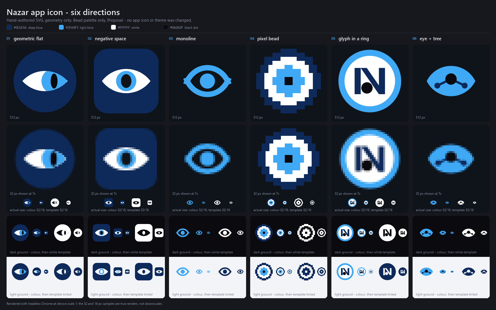
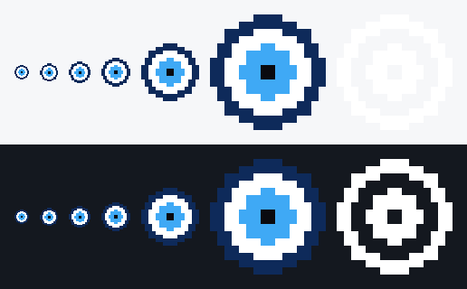

# Nazar app icon — six directions, and the one that was chosen

> **Chosen: 04 — pixel bead.** These six were a proposal when the file was written;
> direction 04 is the mark now. `icon-04-pixel-bead.svg` and its `-mono` template are
> the masters, and every drawing of the bead in the product is compared against them by
> a test. See [Applied](#applied) at the foot of this file for what changed and where.

Every mark is hand-authored SVG: paths, circles and rects with numbers chosen on
purpose. No raster source, no traced art, no fonts — the "N" in direction 05 is
drawn as two rectangles and a quadrilateral, not set in a typeface. Palette is the
bead only, no accent tint was needed:

| token | hex |
| --- | --- |
| deep blue | `#0E2A5A` |
| light blue | `#3FA9F5` |
| white | `#FFFFFF` |
| black dot | `#0A0A0F` |

Deliberately absent: gradients, sheen, drop shadows, glossy concentric rings, and
the badge-with-a-logo-in-it look. Direction 02 is the one rounded square in the
set, and it is a rounded square because the negative-space idea needs a solid
plate to cut into.

## The directions

**01 — geometric flat** (`icon-01-geometric-flat.svg`)
The eye is the lens where two 30-unit circles overlap, and the iris is a third
circle pushed off-centre and clipped by that lens, so the bead reads as a sideways
glance instead of a target. A vertical slit pupil replaces the usual round dot,
which is what keeps it from collapsing into the stock bead drawing.

**02 — negative space** (`icon-02-negative-space.svg`)
A solid plate carries the eye and the pupil is simply absent — a hole punched
through plate, sclera and iris in one mask. On a dark ground the missing dot reads
as the bead's black pupil; on a light ground the mark inverts and the pupil goes
pale, which is a feature if you like it and a dealbreaker if you don't.

**03 — monoline** (`icon-03-monoline.svg`)
One weight, one colour, on a 24-unit grid with a 2-unit stroke, so it sits in the
same optical family as the Lucide/Feather glyphs a toolbar is likely to already
contain. The two lids are separate strokes with square-cut ends that stop short of
the corners, so the open tips read as a deliberate break rather than as two knobs
stuck on the ends.

**04 — pixel bead** (`icon-04-pixel-bead.svg`) — **chosen**
Authored directly on the 16×16 grid the tray actually uses: every cell is a whole
unit, so at 16 px each rect lands on exactly one device pixel and nothing is
resampled. Blown up to 512 the same file becomes deliberate 8-bit art, which is a
strong personality choice and the least neutral thing in the set.

**05 — glyph in a ring** (`icon-05-glyph-ring.svg`)
A bold N in a white field inside the bead ring, built from two 6-wide stems and a
diagonal band. The pupil is the circle inscribed in the N's lower-left counter —
the largest circle the letterform will hold — so the letter's negative space and
the eye are the same shape, while the upper counter stays open so the N still
reads as an N.

**06 — eye + tree** (`icon-06-eye-tree.svg`)
The pupil is the root node of a three-node tree: one session, two subagents, which
is what Nazar actually watches. The fork is wide and shallow on purpose — a root
left with children right is the share glyph, a steep downward fork is a user
avatar, and an upward fork is a pair of ears.

## Files

For each direction `NN-slug`:

- `icon-NN-slug.svg` — colour master
- `icon-NN-slug-mono.svg` — monochrome white master for tray/template use, where
  the structure is carried by holes rather than by colour so a host can tint it
- `icon-NN-slug-512.png`, `icon-NN-slug-32.png` — colour renders
- `icon-NN-slug-mono-512.png`, `icon-NN-slug-mono-32.png` — template renders

`icon-directions.png` is the contact sheet: six columns, three rows — the 512
render, the true 32 px render enlarged 7× with no interpolation, and the same mark
on a dark ground over a light ground with 64/32/16 px samples on each.

## Rendering

There is no bundled renderer and no network step. The PNGs come from headless
Chrome pointed at a local `file://` page that embeds each SVG at exact CSS pixel
sizes, captured at `--force-device-scale-factor=1` with
`--default-background-color=00000000` for transparency; the crops and the contact
sheet layout are assembled with Pillow. The 32 px and 16 px samples are true
renders at that size, not downscales of the 512, because how a mark survives the
rasteriser at 16 px is the only question that matters for the tray.

## Applied

Left to right in each band: the tray's own sizes at **true scale** — 16, 20, 24, 32 and
64 px, which is what `icon::size_for_scale` hands Windows at 100 %, 125 %, 150 %, 200 %
and 400 % — then the 16 px render enlarged eight times so the cells can be counted, then
the 16 px **template** enlarged the same. Light ground above, dark below; the template is
white and therefore invisible on the light one, which is the whole reason Windows takes
the colour variant and only macOS takes this one. Every enlargement is nearest neighbour
at an integer multiple, so the picture shows the cells and not an interpretation of them.

Regenerate it with `node scripts/render-app-icons.mjs --strip`.

### Where the mark now lives

The grid is written out six times, and a test compares all six against the masters above
so they cannot drift:

| copy | file | how it is drawn |
| --- | --- | --- |
| master, colour | `docs/design/icon-04-pixel-bead.svg` | 60 `<rect>` runs |
| master, template | `docs/design/icon-04-pixel-bead-mono.svg` | 38 `<rect>` runs |
| shipped artwork, favicon | `packages/ui/assets/nazar.svg` | the master at 32 px |
| the canvas's own source | `packages/ui/src/bead.ts` | sixteen strings, and the path builder |
| the canvas page | `packages/ui/web/index.html` | four inline `<path>` per bead |
| the desktop boot page | `apps/desktop/shell/index.html` | the same, in hexes |
| the tray rasteriser | `apps/desktop/src/icon.rs` | sixteen `b"…"` rows |

`packages/ui/test/bead.test.ts` parses every one of them back into a grid of characters
and compares; `apps/desktop/src/icon.rs`'s own tests do the same from the Rust side, and
also read the two masters directly. Geometry, never bytes — a file may reformat itself
freely and may not draw a different bead.

### What the application icon is generated by

**Not `cargo tauri icon`, and this is the one surprise in the whole change.** The CLI
takes one large PNG and resamples it down with a smooth filter, which is correct for a
vector mark and wrong for this one: measured on its own output here, the 32 px icon came
back with **268 partly transparent pixels** and a soft halo around every cell — a blur of
8-bit art, which is worse than either the art or the circles it replaced.
`scripts/render-app-icons.mjs` renders each size from the grid instead, nearest neighbour,
and packs the same containers the CLI produced: PNG-in-ICO at 16/24/32/48/64/256, and an
`.icns` of the PNG-carrying types. Zero dependencies, no browser, no network.

    node scripts/build-desktop.mjs --icons     # or: node scripts/render-app-icons.mjs

### What is deliberately still round

Nothing in this repository. `nazar-tray` — a separate program — draws its own bead at run
time with a fill that rises with the quota, and it has not been touched; adopting the
pixel grid there is a decision for that repository, and the two marks sitting side by side
in one Windows tray is the argument for making it.
